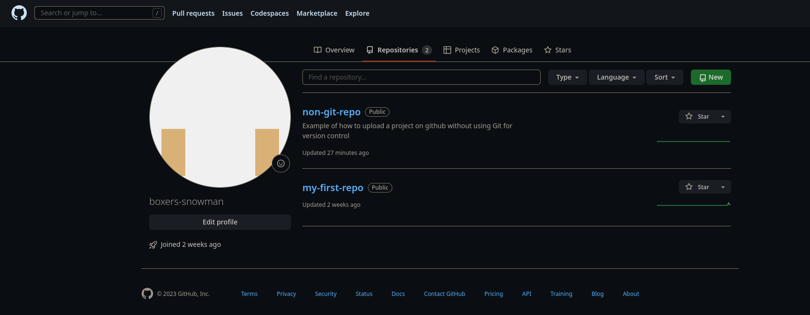
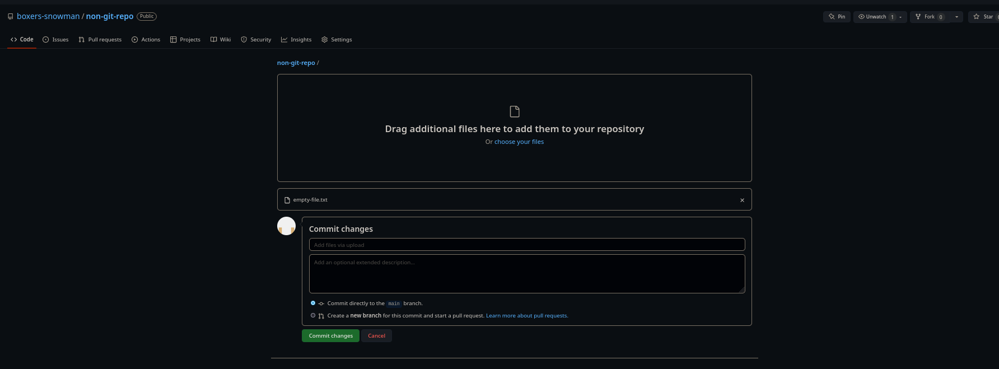

# Example of how to upload projects to github without the use of the command line and Git

Github is a great way to store your projects. You can have access to you files from any machine and you can showcase your work!

## Requirements 

- Github account

### How to upload a project on Github without using git

- Navigate to your Github profile, and click on repositories. Next click on new 

- Fill out the required areas, and add a README.md file. A README is rendered on Github and gives information regarding the project. 

- Finally, drag and drop files or folders that you want in the Github repository. Write short relevant commit message, and click commit changes.

## For for information on how to write a good READMEs

- [awesome-readme](https://github.com/matiassingers/awesome-readme) - A repository of several READMEs to draw inspiration from

